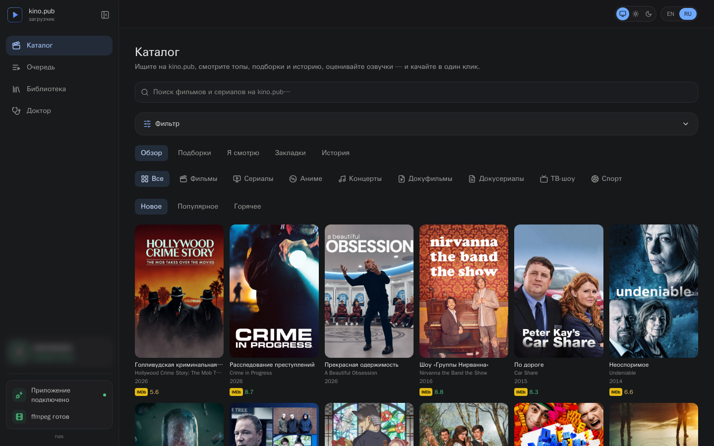
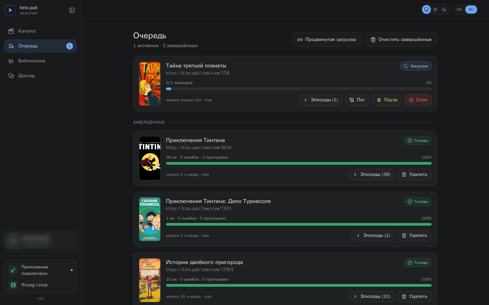
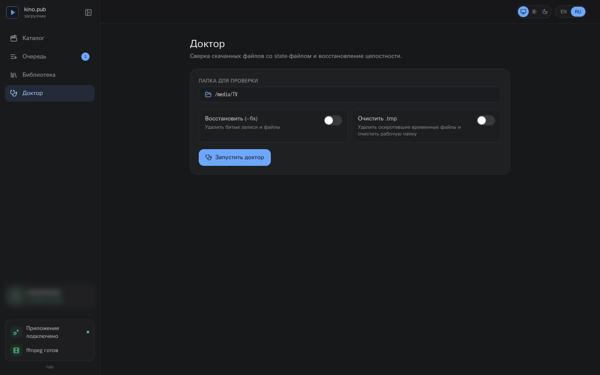
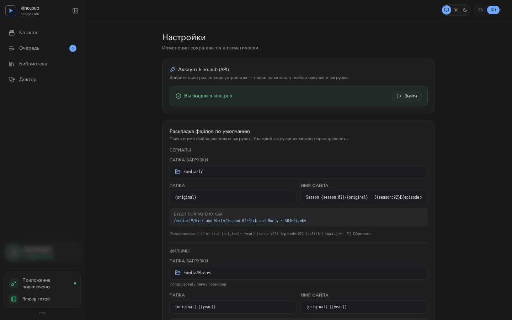
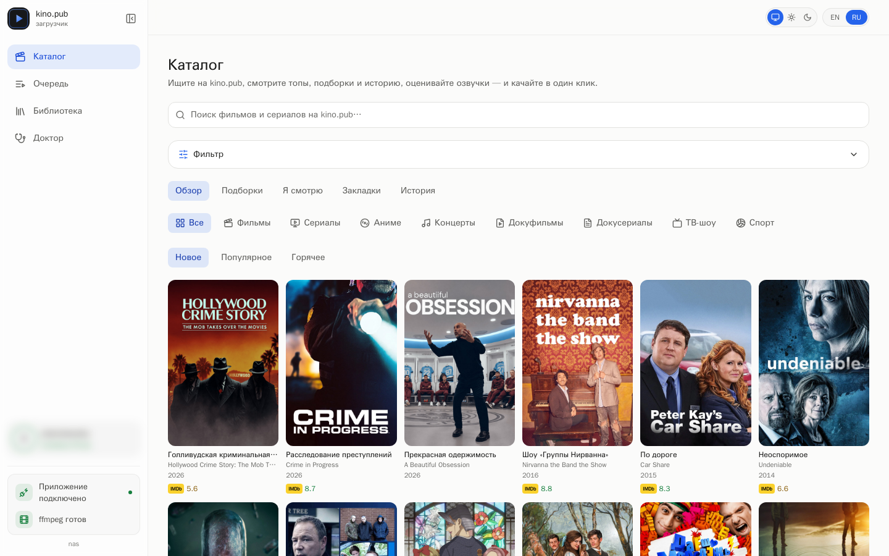

<p align="right"><a href="README.md">Русский</a> · <b>English</b></p>

# kino.pub downloader · GUI

**An app for downloading from [kino.pub](https://kino.pub), with a real interface.** Run it and it opens as a browser tab. Browse the catalog, preview a title right in the player, and download — movies and whole series, with every audio track and subtitle. While it downloads you see per-episode progress: speed and how much is left.

You sign in once, with a short device code. Nothing heavy under it — a single file, no Electron, no Node (a Go server with the React UI built in). Run it and you're set.

> **This is a fork of [ZioSHik/kinopub-gui](https://github.com/ZioSHik/kinopub-gui)**, adapted for running on a home server. What differs from upstream: [folder and file-name templates](#6-file-names-and-folders) instead of the fixed `Title/Season NN/SNNENN` layout, a [`-lan`](#flags) flag for access over a local IP, a `-no-self-update` flag, and a [Docker build](#running-on-a-home-server-docker).

<p align="center">
  
</p>

<p align="center">
  
  
  
  
  
</p>

---

## Highlights

- 🎬 **Catalog browser** — search, tops, collections (подборки), genre/country filters, year and IMDb/Kinopoisk rating ranges, your watch history and "continue watching", and per-title detail with plot, cast, ratings and the full season/episode tree.
- ▶️ **Built-in player** — preview any title right in the app before you download it. The stream goes through the app itself, so there's nothing to set up in the browser.
- 🎬 **Full-fidelity downloads** — every audio track, every subtitle, whole multi-season series — picked from the catalog or pasted as a direct link.
- ⚡ **Live progress** — per-episode and per-track percentages, speed, and ETA — all updating in real time.
- 🔊 **Pick your dubs** — choose which voiceovers to keep right on the title page (remembered for next time) or in a timed picker when downloading from a link; your choice is generalized across episodes.
- 📡 **Follow a series** — for a show still airing, turn on *Follow*: the app asks kino.pub for new episodes on its own and queues them with the same settings.
- 🩺 **Doctor** — verify downloads against the state file and repair inconsistencies, with a readable report.
- 📚 **Library** — browse what you've already downloaded, with sizes, resolutions and missing-file detection; open a finished file or reveal its folder.
- 🔐 **Sign in once** — a short device-code login; tokens are stored encrypted and machine-bound. Local features (Library, Doctor, Settings) work without signing in.
- 🌍 **Bilingual** — English & Russian, switchable in one click (remembered between sessions).
- 🌗 **Day and night** — the interface follows the device's system theme or is pinned by hand; the choice is shared across devices.
- 📦 **Single binary** — the UI is embedded, with no Electron or Node at runtime; or run it in Docker on a home server.

## Screenshots

| Catalog browser | Live queue |
| --- | --- |
|  |  |

| Doctor | Settings |
| --- | --- |
|  |  |

---

## Requirements

- **ffmpeg** — the app uses it to merge video, audio and subtitles into one file. If it's installed (on your `PATH`), the app picks it up on its own; the Settings page shows a green or red check for `ffmpeg` and `ffprobe`.
  ```bash
  brew install ffmpeg          # macOS
  sudo apt install ffmpeg      # Debian/Ubuntu
  ```
  ```powershell
  winget install Gyan.FFmpeg   # Windows (or: choco install ffmpeg / scoop install ffmpeg)
  ```
  On Windows, make sure `ffmpeg.exe` and `ffprobe.exe` are on your `PATH` (the package managers above do this) — the Settings page confirms both are found.

  **Don't want to install it by hand?** If ffmpeg is missing, hit **Settings → System → Install ffmpeg** (the same button is on the Download page) — the app downloads a ready-made build for your system and uses it from then on. Nothing is written into the system, no admin rights needed.
- A browser (the app opens in whatever is your default).
- A kino.pub account with an active subscription — without it there's no catalog, no playback, no downloads.

## Install & run

There are no prebuilt binaries: neither this fork nor upstream publishes GitHub releases (`ZioSHik/kinopub-gui/releases` is empty). Build it one of two ways.

### Option A — Docker (home server, NAS, Raspberry Pi)

The primary path in this fork — see [Running on a home server](#running-on-a-home-server-docker). Nothing to install besides Docker: ffmpeg and the UI are already in the image.

### Option B — build from source

You need Go 1.26+ and Node 20+ (only to build the UI; not at runtime).

```bash
git clone https://github.com/WhyElEss/kinopub-gui
cd kinopub-gui
make run          # builds the web UI, builds the GUI binary, and launches it
```

Or step by step:

```bash
make web          # build the React frontend into web/dist (embedded via go:embed)
make gui          # build the ./kinopub-gui binary
./kinopub-gui     # → opens http://127.0.0.1:8765 in your browser
```

The binary is self-contained: the React UI is embedded via `go:embed` and the built `web/dist` is committed, so `go build ./cmd/kinopub-gui` works without Node (`make web` regenerates it when you touch the frontend). `make release-gui` cross-compiles for every platform, and `make dmg` packages the macOS app.

> `go install github.com/ZioSHik/kinopub-gui/cmd/kinopub-gui@latest` installs **upstream**, without this fork's changes: the module path in `go.mod` is still upstream's, so that every import didn't have to be rewritten. For the fork, use `make` or Docker.

Your own builds aren't signed by Apple or Microsoft, so macOS and Windows warn on first launch (**Privacy & Security → Open Anyway** / **More info → Run anyway**). Credentials are stored encrypted at `~/.config/kinopub/credentials.enc` (`%USERPROFILE%\.config\kinopub\credentials.enc` on Windows).

### Flags

```
kinopub-gui [flags]
  -addr            address to listen on (default 127.0.0.1:8765;
                   falls back to an ephemeral port if taken)
  -no-open         do not open the browser automatically
  -lan             accept requests from the local network too
  -no-self-update  disable the in-app updater (container/package installs)
  -version         print version and exit
```

By default the server listens on your computer only (`127.0.0.1`) — it's not a public service, nothing outside can reach it. It also rejects requests that don't come from its own page, so a random site in your browser can't quietly poke at it.

`-lan` lifts that for your local network: together with `-addr 0.0.0.0:8765` the app becomes reachable at something like `http://192.168.2.200:8765` from any device in the house. Only private addresses (RFC1918, link-local), `*.local` names and single-label hostnames are accepted; public domains are still rejected. **The app has no login** — anyone who can reach the port gets the server's filesystem, its downloads and your kino.pub account. Don't port-forward it.

### Updating

Updating the fork means `git pull` and a rebuild (`make run`, or `docker compose up -d --build` for the container).

Upstream's in-app updater is still in the code, but there is nothing here for it to find: it looks for releases in `ZioSHik/kinopub-gui`, and there are none — **Settings → Software update** simply shows the current version. In the container it is switched off with `-no-self-update` and says so in the UI.

---

## Using it

### 1. Sign in

Local features — **Library, Doctor, Settings, the folder picker** — work without signing in. The catalog, search, the in-app player and downloads need an account.

Click **Sign in** (top-right or in the sidebar) and:

1. The app shows a short **device code** and a link (`kino.pub/device`).
2. Open that link in any browser where you're logged into kino.pub and enter the code.
3. Confirm — the app detects it within a couple of seconds and you're in.

The device shows up in your kino.pub account's device list as `kinopub-gui (your-hostname)`. Tokens are stored encrypted, tied to your computer, and kept at `~/.config/kinopub/credentials.enc`. Sign out any time from Settings.

> **kino.pub is often unavailable without a VPN.** If sign-in, the catalog or downloads hang or time out, enable a VPN or set a proxy (Settings → Proxy, or per-download in Advanced options). The UI shows a reminder and detects timeouts.

### 2. Find something

Open **Catalog** to search and browse. Filter by type, genre, country, year range and IMDb/Kinopoisk rating; browse tops and collections; or jump back into your **history** and **continue-watching** rows. Open a title to see its details, ratings, available voiceovers and the full season/episode tree — and hit ▶ to **preview it in the built-in player** before downloading.

You can also paste a kino.pub link directly on the **Download** page if you already have one.

### 3. Download

From a title's detail view (or the Download page), tick the seasons/episodes you want, pick a quality, and hit **Start download**. Progress shows up under **Queue** — overall, per-episode, and per track, with speed and ETA.

An **Advanced options** panel covers the fine print: container (MKV / MP4), concurrency, retries, request throttle, proxy (HTTP/HTTPS/SOCKS5), *Force re-download* and *No chunked download* toggles, verbose logs, and an extra-ffmpeg-args field. It's pre-filled from your Settings, so most of the time you can leave it alone.

**Following a show that is still airing.** The episode list is captured when a download is queued, so a series with 3 of 10 episodes out stays a three-episode download forever. The **Follow** button on a title's page lifts that: the app asks kino.pub what the series has now, every few hours, and queues whatever is missing from disk — at the quality, voiceover, folder and name template that were selected when following started.

- The seasons followed are the ones your selection covered. Select every season and future ones are followed too, so a show that rolls over into its next season keeps downloading.
- An episode that is announced but not yet encoded (no files) is skipped until a later check.
- Each episode is queued once: if its card fails, the card stays in the queue with its own **Retry**, and following does not pile up identical cards. Remove the card (or "Clear finished") and the next check picks that episode up again.
- Followed series are listed on the **Queue** page: when they were last checked, how many episodes exist and how many are downloaded, plus *Check now*, *Pause checks* and *Stop following*. The list survives a restart (`watchlist.json`, next to the settings).

### 4. Audio tracks

You pick dubs/voiceovers right where you start the download:

- **From a title's page** in the catalog — under **Voiceover**, tick the tracks you want to keep (with *Select all* / *Deselect all*). Your choice is remembered and pre-applied on the next titles; if your last voiceover isn't available here, the app prompts you to pick another.
- **When downloading from a direct link** (the Download page), the picker pops up as a timed modal the moment the download starts: tick the tracks, *Only this* to keep one, or *Keep all* to take everything (also what the timer does on expiry).

Your choice is generalized across episodes and matched by language: if a chosen dub is missing from some episode, the engine falls back to another track in the same language. By default every track is kept.

### 5. Doctor & Library

- **Doctor** verifies files against the state file (missing, truncated, size mismatch, incomplete record, orphan `.tmp`) and repairs them in one click — a *Repair* toggle (drop broken entries and files) and a *Clean .tmp* toggle. It checks file presence and recorded size on disk — a fast, offline pass with no network round-trip.
- **Library** scans both output folders (plus any extras from Settings) for `.kinopub-state.json` files and lists everything you've downloaded, flagging files that have gone missing on disk. Open or reveal any file straight from the list.

### 6. File names and folders

Where files land is decided by three things: the output folder (picked with a button) and two templates — **Folder** and **File name**. The full path is `<output folder>/<folder template>/<name template>.<mkv|mp4>`; the name template may contain `/` to nest deeper (that is how the season folder is made by default). What the result will look like is shown right under the fields.

Tokens:

| Token | Value |
| --- | --- |
| `{title}` | the title as kino.pub gives it, e.g. `Рик и Морти / Rick and Morty` |
| `{ru}` | the Russian half of the title |
| `{original}` | the original-language half (or the API's `subname`) |
| `{year}` | release year |
| `{season}`, `{episode}` | numbers; `{season:02}` zero-pads |
| `{epTitle}` | episode title |
| `{quality}` | quality, e.g. `1080p` |
| `{id}` | the title's kino.pub id |

A slash **inside** a value (in the title) does not create a folder — it becomes `_`; directories appear only where you typed `/` in the template itself. Empty components are dropped, and if a template collapses to nothing a fallback name is used (`series_<id>` / `S01E01`).

Settings keeps **a separate set for series and for films** — its own output folder and its own pair of templates. The app picks the right set when you open a title: a series goes to, say, `/media/TV` and a film to `/media/Movies`. Leave the film folder unset and films land wherever series do. The title window (**Where to save**) overrides both the folder and the templates for one download. Out of the box:

```
series:  {title}                +  Season {season:02}/S{season:02}E{episode:02}
films:   {original} ({year})   +  {original} ({year})
```

The film layout deliberately differs from upstream: `The Matrix (1999)/The Matrix (1999).mkv` is what Plex, Jellyfin and Emby expect (they match metadata on the original title), whereas a film inside `Season 01/S01E01.mkv` confuses them. When a film has no separate original title, `{original}` falls back to the Russian one.

**An empty field does not mean "no folder":** the server and the preview both substitute the built-in default there. The folder template always yields at least one directory — see the note below.

> The state file `.kinopub-state.json` and the poster live in the series folder (the **Folder** template), so that template must always yield at least one directory — otherwise two titles in one folder would overwrite each other's state. Changing the template for an already-downloaded title makes the app treat it as new: the old files stay where they are, but "already downloaded" no longer attaches to them.

### 7. Quality

Two entries in the quality dropdown are not resolutions:

- **Auto (optimal)** (the empty value) — a bitrate compromise: 1080p h264 up to ~3000 kbps, else the best 720p. It is the default, and it never reaches 2160p.
- **Maximum** — the highest-bandwidth variant available; the only one that picks up 4K when the file exists.

The rest are explicit resolutions (`1080p`, `720p`, …), listed from what the title actually offers. The default lives in Settings; a single download overrides it in the title window.

### 8. Work folder

While a download runs, intermediate files appear next to the final one: the HLS segment directory, the joined `.ts` stream, ffmpeg's `.tmp` output, and `.raw`/`.part` for direct links. The finished file appears by an atomic rename, so a half-written `.mkv` never exists under the real name — but the debris still sits in the media library. `.ts` is the harmful one: Plex treats it as a video file and may pull it in.

**Settings → Work folder** moves everything intermediate into a directory of its own. Empty keeps the old behaviour (next to the final file).

Keep it **on the same disk** as the output folders: then the finished file is moved by an instant `rename`. On a different filesystem the move falls back to a copy — an extra pass over every gigabyte, though the file still appears atomically. For a media server a hidden directory inside the library volume works well, e.g. `/media/.kinopub-tmp`: both Plex and the app's own Library skip dot-directories.

Names inside the work folder are deterministic (the output's file name plus a hash of its full path), so an interrupted download finds its own segments after a restart and resumes, and two titles sharing a file name never collide.

Leftovers from a hard crash are handled by the **Doctor**: it reports how many items the work folder holds and how much space they take, and removes them when "Clean .tmp" is ticked. While any download is active — **including a paused one** — the folder is left completely alone and the Doctor says so: those files are exactly what a paused download resumes from.

### 9. Appearance

Next to the language switcher in the header sit three buttons: **Auto · Day · Night**.

"Auto" is the default: the interface follows the system theme of whatever device it is opened from (`prefers-color-scheme`), so it darkens in the evening along with macOS or a phone. Day and Night pin the theme regardless of the system.

The choice is stored in the settings **on the server**, so it is the same on every device you open the app from; the last value is also cached in the browser and applied before the first paint, so a reload never flashes the wrong theme.

Both themes are built on CSS variables: components carry no per-theme colour duplicates, and switching is a swap of one variable set.

The values are the bluesky-feedgen admin palette, shared between the two projects, and every colour has exactly one job: **blue** (`#2563eb` by day, `#6ea8fe` by night) is the only accent — buttons, the active nav item, focus, a running download; **green** is success; **orange** is only ever a warning (paused, retrying after an error); **red** is an error. The accent used to be gold, which left orange meaning both "act on this" and "look at this" — "downloading" and "paused" differed only in saturation of one hue. Surfaces are flat: one background colour, a 1px line, no glow and no gradients.

Text contrast against the card is measured rather than eyeballed: every step clears 4.5:1 in both themes except the quietest one (`slate-600`, 3.59:1 dark and 4.13:1 light), which is the version string, log timestamps and the DEBUG level.

<p align="center">
  
</p>

### 10. Settings

Defaults for new downloads (output folders and path templates — separately for series and films, quality, container, concurrency, retries, throttle, proxy), how often followed series are re-checked (15 minutes to 24 hours, 3 hours by default), plus extra folders to scan in the Library, the kino.pub sign-in, the ffmpeg installer and the software updater. Stored at `~/.config/kinopub/gui.json` (or `$XDG_CONFIG_HOME/kinopub/gui.json`).

---

## Running on a home server (Docker)

For a NAS or a Raspberry Pi the repo ships a `Dockerfile` (UI + static binary + ffmpeg) and `deploy/docker-compose.yml`. It builds for whatever architecture it runs on — native arm64 on a Pi, no emulation.

```bash
git clone https://github.com/WhyElEss/kinopub-gui ~/kinopub-gui
cd ~/kinopub-gui/deploy
# adjust the volumes (your media library) and TZ
docker compose up -d --build
```

Then open `http://<server-ip>:8765` from any device on the network and sign in to kino.pub with the device code.

What matters about this setup:

- the container starts with `-addr 0.0.0.0:8765 -lan -no-open -no-self-update`; **there is no authentication**, so keep the port inside your local network;
- the folder picker in the UI browses the **container's** filesystem — only what you mounted can be chosen (`/mnt/share/Media` → `/media` in the example);
- `user: "1000:1000"` — files are written as the media library's owner, not as root;
- `/config` (settings and the encrypted kino.pub tokens) lives in the named volume `kinopub-config` rather than in the repo directory — otherwise a `git clone`/rsync over the sources would wipe the saved login. Read it with `docker run --rm -v kinopub-config:/c alpine cat /c/kinopub/gui.json`;
- `KINOPUB_OUTPUT_DIR` seeds the output folder on first run (after that the value comes from settings);
- `/etc/machine-id` is mounted from the host: the token encryption key derives from it, and without the file it falls back to the boot id, which changes on every reboot — the login would be lost each time;
- the in-app updater is disabled: update the image by rebuilding (`docker compose up -d --build`).

---

## How it works

```
┌──────────────────────────────┐        SSE (live progress)        ┌───────────────────────┐
│  React + TS + Tailwind UI     │ ◀───────────────────────────────── │  Go HTTP server       │
│  (embedded via go:embed)      │ ──── REST (commands) ────────────▶ │  internal/gui         │
└──────────────────────────────┘                                    └─────┬───────────┬─────┘
                                                                          │ drives    │ API
                                                          ┌───────────────▼──┐   ┌────▼──────────────┐
                                                          │ kinopub engine    │   │ kino.pub API      │
                                                          │ internal/app +    │   │ services/kinopubapi│
                                                          │ services (HLS,    │   │ (device login,    │
                                                          │ downloader, …)    │   │ discovery, stream)│
                                                          └───────────────────┘   └───────────────────┘
```

The server doesn't run the engine as a separate process — it works with it directly, in one program: download progress streams to the browser live, the audio picker pops up and holds the download until you answer, and the engine's log shows up in each job's log view.

Catalog and playback go through `internal/services/kinopubapi`, a small client for the kino.pub API: it keeps you signed in and refreshes the tokens on its own. The player gets video through `/api/hls`, a proxy inside the app itself; every link is signed, so it can't be reused as someone's open proxy.

### Project layout

```
cmd/
  kinopub-gui/      GUI server entrypoint (embeds the UI, opens the browser, macOS/Windows tray)
internal/
  app/kinopub/      engine composition root (App.Run)
  domain/           ports & models
  services/
    kinopubapi/     kino.pub API client (device login, discovery, stream resolution)
    downloader/     HLS + file download, ffmpeg muxing
    hlsdownloader/  HLS manifest parsing & segment download
    doctor/         verify & repair downloads
    statestore/     per-series .kinopub-state.json
    …               outputlayout, scheduler, progress, proxyprovider
  gui/              REST + SSE server, job manager, series watcher, discovery, HLS player proxy, reporter/chooser
  lib/              credstore (encrypted creds), httpx (uTLS), logx, audiomenu, …
web/                React + Vite + Tailwind frontend
  dist/             built UI, embedded into the binary (go:embed)
Dockerfile          image build: UI → static binary → Alpine with ffmpeg
deploy/             docker-compose.yml for a home server
```

## Development

```bash
# Terminal 1 — run the Go server (serves the embedded UI + API)
make gui && ./kinopub-gui

# Terminal 2 — hot-reloading frontend with API proxy to :8765
make dev            # → http://localhost:5173
```

`make vet` runs `go vet`, `make test` runs the test suite. CI builds the UI, vets, and runs the suite (including the race detector) on Linux, Windows and macOS.

## Credits

- The download engine and the hard parts it grew from (HLS, retries, encrypted creds, doctor): **[niazlv/kinopub-downloader](https://github.com/niazlv/kinopub-downloader)**.
- The web interface, the catalog/player integration, and the packaging (`cmd/kinopub-gui`, `internal/gui`, `internal/services/kinopubapi`, `web/`): this project.

## License

MIT — see [LICENSE](LICENSE). The upstream engine is MIT-licensed; this repository preserves that license and adds the GUI under the same terms.
